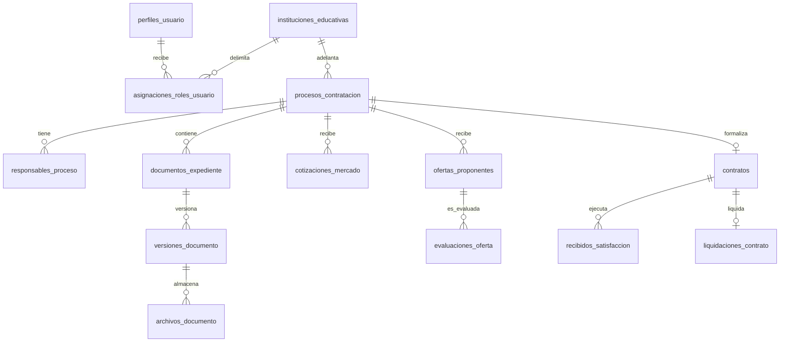

# Diseño de Supabase multiinstitucional para LEXCON IAG

- **Fecha:** 2026-10-07
- **Estado:** Listo para validación detallada antes de implementar
- **Alcance:** Modelo relacional, seguridad, almacenamiento documental y continuidad operativa para LEXCON IAG y sus múltiples Instituciones Educativas. INEM de Montería será la primera IE que opere un proceso real.

## Decisiones aprobadas

1. La nomenclatura de las entidades, tablas, columnas, restricciones y explicaciones funcionales será íntegramente en español. Los identificadores técnicos usan `snake_case`, no tildes ni caracteres especiales: `instituciones_educativas`, `id_proceso`, `creado_en`.
2. Supabase PostgreSQL será la fuente estructurada de información de LEXCON IAG.
3. Supabase Storage usará un bucket privado como repositorio inicial de los archivos físicos del proceso contractual.
4. La primera operación real de INEM de Montería se ejecutará en el proyecto Supabase Free compartido de LEXCON IAG, con PostgreSQL, Storage privado, RLS y respaldos manuales de base y archivos.
5. El proyecto se actualizará al mismo proyecto Supabase Pro cuando se incorpore la primera IE cliente, se acerque a un límite, o el piloto exija continuidad y respaldos administrados.

## Límites del piloto

La plataforma admite documentación real de varias IE y, por tanto, se ejecuta en un proyecto de LEXCON IAG aislado de otros productos. No se usan cuentas compartidas, buckets públicos, enlaces permanentes ni datos ficticios para sustituir la evidencia real. El equipo debe monitorear los límites vigentes del plan Free antes de cada cargue significativo.

La base se respalda manualmente antes de cada hito y al cierre de cada jornada con actuaciones. Los archivos se exportan en una copia privada externa con un manifiesto que contiene la ruta lógica, el tamaño, el hash SHA-256, el identificador de versión y la fecha de verificación. Un respaldo de PostgreSQL no incluye los objetos de Storage.

## Esquemas y convenciones

- `auth`: esquema administrado por Supabase. `auth.users` autentica a las personas; no se replica su contraseña en tablas propias.
- `public`: información operativa consultada por la aplicación y protegida con RLS.
- `privado`: información técnica de IA, colas y detalles operativos que solo usa el servidor o worker; no se expone por Data API.
- Todas las claves primarias propias son `uuid` con valor por defecto `gen_random_uuid()`.
- Toda fecha es `timestamptz`; todo valor monetario es `numeric(18,2)`; toda evidencia flexible o proveniente de IA usa `jsonb` junto con sus columnas consultables.
- Las tablas operativas incluyen `creado_en`; las que se administran incluyen también `actualizado_en`.
- Los archivos no se borran físicamente por una acción ordinaria: se marcan como retirados, se conserva la versión y se genera auditoría.

## Diagrama de relaciones principales



## Seguridad, personas e instituciones

| Tabla | Campos | Información que guarda |
|---|---|---|
| `perfiles_usuario` | `id_usuario PK→auth.users`, `correo_electronico`, `nombre_completo`, `telefono`, `activo`, `ultimo_acceso_en`, `creado_en`, `actualizado_en` | Perfil operativo de cada persona autenticada. |
| `instituciones_educativas` | `id`, `nombre_oficial`, `numero_identificacion_tributaria`, `codigo_dane`, `municipio`, `departamento`, `direccion`, `correo_institucional`, `telefono`, `estado_servicio`, `observacion_servicio`, `creado_en`, `actualizado_en` | Datos de la IE, relación de servicio y estado administrativo. |
| `periodos_servicio_ie` | `id`, `id_institucion`, `fecha_inicio`, `fecha_fin`, `estado`, `nota`, `registrado_por`, `creado_en` | Historia de activación, suspensión o finalización del servicio. |
| `roles` | `id`, `codigo`, `nombre`, `descripcion`, `es_sistema`, `creado_en` | Catálogo: administrador Arka, abogado Arka, rector, apoyo IE y comité evaluador. |
| `permisos` | `id`, `codigo`, `recurso`, `accion`, `descripcion`, `creado_en` | Acciones permitidas: consultar, cargar, revisar, aprobar, asignar, publicar o cerrar. |
| `permisos_roles` | `id_rol`, `id_permiso`, `creado_en` | Relación de permisos aplicables a cada rol. |
| `asignaciones_roles_usuario` | `id`, `id_usuario`, `id_rol`, `id_institucion nullable`, `activo`, `vigente_desde`, `vigente_hasta`, `asignado_por`, `creado_en` | Rol global Arka o rol limitado a una IE. |

## Manual de contratación y reglas institucionales

| Tabla | Campos | Información que guarda |
|---|---|---|
| `manuales_contratacion` | `id`, `id_institucion`, `titulo`, `estado`, `creado_por`, `creado_en` | Identidad lógica del Manual de contratación IE. |
| `versiones_manual_contratacion` | `id`, `id_manual`, `numero_version`, `vigente_desde`, `vigente_hasta`, `estado`, `id_version_documento_origen`, `creado_por`, `creado_en` | Versiones aprobadas del manual sin alterar procesos ya abiertos. |
| `reglas_manual_contratacion` | `id`, `id_version_manual`, `codigo_regla`, `categoria`, `texto_regla`, `valor_estructurado`, `referencia_origen`, `estado_verificacion`, `creado_en` | Reglas extraídas: cuantías, plazos, garantías, cronogramas y responsables. |
| `hallazgos_reglas_manual` | `id`, `id_regla_manual`, `tipo_hallazgo`, `descripcion`, `gravedad`, `resuelto_por`, `resuelto_en`, `creado_en` | Ambigüedades, contradicciones o vacíos que bloquean una actuación. |

## Procesos, responsables, estados y tareas

| Tabla | Campos | Información que guarda |
|---|---|---|
| `procesos_contratacion` | `id`, `id_institucion`, `consecutivo_institucional`, `numero_proceso`, `tipo_contrato`, `objeto_contractual`, `id_version_manual_aplicable`, `fase_actual`, `estado_actual`, `abierto_por`, `abierto_en`, `cerrado_en`, `creado_en`, `actualizado_en` | Unidad principal del proceso contractual. Tiene índice único por IE y consecutivo. |
| `responsables_proceso` | `id`, `id_proceso`, `id_usuario nullable`, `nombre_externo nullable`, `tipo_responsabilidad`, `activo`, `asignado_por`, `asignado_en`, `retirado_en` | Abogado, rector, apoyo, integrantes del comité y supervisor. |
| `historial_fases_proceso` | `id`, `id_proceso`, `fase_origen`, `fase_destino`, `accion`, `estado_anterior`, `estado_posterior`, `id_actor`, `observacion`, `creado_en` | Toda transición de fase y decisión humana. |
| `bloqueos_proceso` | `id`, `id_proceso`, `alcance`, `motivo`, `gravedad`, `activo`, `abierto_por`, `resuelto_por`, `resuelto_en`, `creado_en` | Restricciones que impiden avanzar sin evidencia o decisión válida. |
| `tareas_proceso` | `id`, `id_proceso`, `titulo`, `descripcion`, `tipo_tarea`, `id_usuario_asignado`, `estado`, `vencimiento_en`, `completado_en`, `creado_en` | Trabajo pendiente de cada responsable. |
| `eventos_cronograma_proceso` | `id`, `id_proceso`, `tipo_evento`, `titulo`, `inicia_en`, `finaliza_en`, `regla_dia_habil`, `estado`, `creado_en` | Cronograma de publicación, ofertas, evaluación y demás hitos. |
| `transiciones_flujo` | `id`, `fase_origen`, `accion`, `fase_destino`, `rol_requerido`, `tipo_evidencia_requerida`, `activo`, `creado_en` | Configuración controlada del flujo, no editable por usuarios institucionales. |

## Documentos, versiones, firmas y publicación SECOP II

| Tabla | Campos | Información que guarda |
|---|---|---|
| `documentos_expediente` | `id`, `id_institucion`, `id_proceso nullable`, `tipo_documento`, `titulo`, `estado`, `id_version_vigente nullable`, `creado_por`, `creado_en`, `actualizado_en` | Documento lógico: CDP, invitación, oferta, contrato, acta u otra evidencia. |
| `versiones_documento` | `id`, `id_documento`, `numero_version`, `origen`, `contenido_texto`, `contenido_estructurado`, `id_version_reemplazada nullable`, `creado_por`, `creado_en` | Versiones inmutables, humanas, generadas o corregidas jurídicamente. |
| `archivos_documento` | `id`, `id_version_documento`, `id_bucket`, `ruta_objeto`, `nombre_original`, `tipo_mime`, `tamano_bytes`, `hash_sha256`, `subido_por`, `estado_archivo`, `creado_en` | Metadatos, integridad y ubicación privada del archivo físico. |
| `revisiones_documento` | `id`, `id_version_documento`, `etapa_revision`, `decision`, `id_revisor`, `observacion`, `revisado_en` | Aprobación, corrección o rechazo jurídico e institucional. |
| `firmas_documento` | `id`, `id_version_documento`, `nombre_firmante`, `calidad_firmante`, `estado_firma`, `firmado_en`, `id_archivo_evidencia`, `creado_en` | Constancia de firma y documento firmado cargado. |
| `relaciones_documento` | `id`, `id_version_documento_origen`, `id_version_documento_destino`, `tipo_relacion`, `creado_en` | Soporte, corrección, reemplazo, anexo o fuente de un documento. |
| `publicaciones_secop` | `id`, `id_proceso`, `id_version_documento`, `referencia_secop`, `publicado_en`, `declarado_por`, `id_archivo_evidencia nullable`, `creado_en` | Declaración institucional, referencia y evidencia opcional de publicación. |
| `ejecuciones_generacion_documento` | `id`, `id_version_documento`, `tipo_generador`, `version_plantilla`, `id_ejecucion_ia nullable`, `hash_entrada`, `estado`, `creado_en` | Trazabilidad técnica de documentos generados por LEXCON. |

## Cotizaciones, extracción y estudio de mercado

| Tabla | Campos | Información que guarda |
|---|---|---|
| `cotizaciones_mercado` | `id`, `id_proceso`, `id_version_documento`, `nombre_proveedor`, `identificacion_proveedor`, `fecha_cotizacion`, `vigencia_hasta`, `moneda`, `subtotal`, `valor_iva`, `valor_total`, `estado`, `creado_en` | Cotización fuente del estudio de mercado. |
| `items_cotizacion_mercado` | `id`, `id_cotizacion`, `numero_linea`, `descripcion`, `descripcion_normalizada`, `codigo_unspsc`, `cantidad`, `unidad`, `valor_unitario`, `subtotal`, `tarifa_iva`, `valor_iva`, `valor_total`, `motivo_exclusion`, `creado_en` | Ítems económicos extraídos y normalizados. |
| `ejecuciones_extraccion` | `id`, `id_proceso`, `id_version_documento`, `tipo_origen`, `analizador`, `modelo_ia`, `estado`, `texto_extraido`, `incidencias`, `iniciado_en`, `finalizado_en` | Lectura técnica de PDF y DOCX, incidencias y resultado. |
| `campos_extraidos` | `id`, `id_ejecucion_extraccion`, `codigo_campo`, `valor_original`, `valor_normalizado`, `confianza`, `pagina_origen`, `fragmento_origen`, `estado_verificacion`, `creado_en` | Datos extraídos de documentos con evidencia de origen. |
| `ejecuciones_comparacion_mercado` | `id`, `id_proceso`, `version_metodologia`, `estado`, `creado_por`, `creado_en` | Ejecución reproducible de la comparación económica. |
| `items_comparacion_mercado` | `id`, `id_ejecucion_comparacion`, `descripcion_normalizada`, `cantidad`, `unidad`, `valor_unitario_minimo`, `valor_unitario_maximo`, `valor_unitario_promedio`, `creado_en` | Resultado comparable por ítem. |
| `valores_comparacion_mercado` | `id`, `id_item_comparacion`, `id_item_cotizacion`, `nombre_fuente`, `valor_unitario`, `tratamiento_iva`, `incluido_en_promedio`, `creado_en` | Cada valor fuente que respalda el cálculo. |
| `perfiles_estudio_mercado` | `id_proceso PK`, `objeto_descripcion`, `codigos_unspsc`, `analisis_demanda`, `analisis_oferta`, `fundamento_tributario`, `actualizado_por`, `actualizado_en` | Complemento institucional del estudio de mercado. |
| `certificados_disponibilidad_presupuestal` | `id`, `id_proceso`, `numero_cdp`, `expedido_en`, `valor`, `rubro_presupuestal`, `id_version_documento`, `estado`, `creado_en` | CDP y sus datos estructurados. |

## Ofertas, evaluación y decisión de selección

| Tabla | Campos | Información que guarda |
|---|---|---|
| `proveedores` | `id`, `razon_social`, `identificacion_tributaria`, `tipo_persona`, `direccion`, `correo_electronico`, `telefono`, `activo`, `creado_en`, `actualizado_en` | Identidad reutilizable de los proponentes. |
| `representantes_proveedor` | `id`, `id_proveedor`, `nombre_completo`, `tipo_documento`, `numero_documento`, `correo_electronico`, `activo`, `creado_en` | Representantes legales u oferentes naturales. |
| `actas_recibo_ofertas` | `id`, `id_proceso`, `recibido_en`, `recibido_por`, `id_version_documento`, `estado`, `creado_en` | Acta institucional de recibo y cierre de ofertas. |
| `ofertas_proponentes` | `id`, `id_proceso`, `id_proveedor`, `id_representante nullable`, `numero_oferta`, `presentado_en`, `medio_recepcion`, `subtotal`, `valor_iva`, `valor_total`, `vigencia_dias`, `estado`, `creado_en` | Oferta económica y documental del proponente. |
| `anexos_oferta` | `id`, `id_oferta`, `id_version_documento`, `tipo_anexo`, `obligatorio`, `recibido_en`, `estado_verificacion`, `creado_en` | Anexos jurídicos, técnicos, financieros y subsanaciones. |
| `items_oferta` | `id`, `id_oferta`, `numero_linea`, `descripcion`, `codigo_unspsc`, `cantidad`, `valor_unitario`, `tarifa_iva`, `valor_iva`, `valor_total`, `creado_en` | Ítems y valores de cada oferta. |
| `integrantes_comite_evaluador` | `id`, `id_proceso`, `tipo_integrante`, `nombre_completo`, `cargo`, `id_usuario nullable`, `activo`, `creado_en`, `actualizado_en` | Evaluadores y supervisor registrados por la IE. |
| `ejecuciones_evaluacion` | `id`, `id_proceso`, `numero_version`, `estado`, `id_version_acta_generada`, `creado_en` | Versión de la evaluación y del acta generada. |
| `evaluaciones_oferta` | `id`, `id_ejecucion_evaluacion`, `id_oferta`, `resultado_juridico`, `resultado_tecnico`, `resultado_financiero`, `resultado_economico`, `resultado_global`, `valor_evaluado`, `orden_elegibilidad`, `creado_en` | Resultado consolidado por oferta. |
| `resultados_requisitos_oferta` | `id`, `id_evaluacion_oferta`, `codigo_requisito`, `categoria`, `resultado`, `id_version_evidencia nullable`, `hallazgo`, `verificado_por`, `verificado_en`, `creado_en` | Resultado verificable de cada requisito habilitante. |
| `observaciones_evaluacion` | `id`, `id_ejecucion_evaluacion`, `id_actor`, `observacion`, `estado`, `resuelto_por`, `resuelto_en`, `creado_en` | Correcciones solicitadas por el comité. |
| `decisiones_seleccion_oferente` | `id`, `id_proceso`, `id_oferta_seleccionada`, `motivacion`, `estado`, `creado_por`, `id_version_acta_firmada nullable`, `creado_en`, `firmado_en` | Selección expresa del comité; nunca se infiere solo por precio. |

## Formalización, ejecución y liquidación

| Tabla | Campos | Información que guarda |
|---|---|---|
| `registros_presupuestales` | `id`, `id_proceso`, `numero_rp`, `expedido_en`, `valor`, `id_version_documento`, `estado`, `creado_en` | RP requerido antes de revisión contractual. |
| `contratos` | `id`, `id_proceso`, `numero_contrato`, `tipo_contrato`, `id_proveedor_contratista`, `id_supervisor nullable`, `objeto_contractual`, `valor`, `moneda`, `plazo_dias`, `fecha_inicio`, `fecha_fin`, `estado`, `id_version_documento`, `creado_en`, `actualizado_en` | Contrato resultante del proceso. |
| `publicaciones_contractuales` | `id`, `id_contrato`, `id_version_contrato`, `id_version_acta_inicio`, `referencia_secop`, `declarado_por`, `publicado_en`, `id_archivo_evidencia nullable`, `creado_en` | Firma, publicación SECOP II y sus soportes. |
| `condiciones_pago_contrato` | `id`, `id_contrato`, `consecutivo`, `descripcion`, `porcentaje`, `valor_programado`, `condicion_pago`, `creado_en` | Uno o varios pagos contractuales. |
| `recibidos_satisfaccion` | `id`, `id_contrato`, `id_condicion_pago nullable`, `tipo_recibido`, `recibido_en`, `valor`, `id_supervisor`, `id_version_documento`, `estado`, `creado_en` | Recibidos parciales o final. Solo el final habilita liquidación. |
| `liquidaciones_contrato` | `id`, `id_contrato`, `estado`, `saldo_final`, `liquidado_en`, `id_version_documento`, `aprobado_por`, `id_version_firmada nullable`, `creado_en` | Acta de liquidación, revisión jurídica y firma final. |
| `declaratorias_desierto` | `id`, `id_proceso`, `motivo`, `declarado_en`, `id_version_documento`, `creado_por`, `creado_en` | Cierre sin selección por ausencia de oferta habilitada. |

## Alertas, auditoría y motores de IA

| Tabla | Campos | Información que guarda |
|---|---|---|
| `alertas` | `id`, `id_institucion`, `id_proceso nullable`, `id_usuario_destinatario`, `tipo_evento`, `titulo`, `mensaje`, `prioridad`, `estado`, `leido_en`, `creado_en` | Alerta interna para el responsable de la siguiente actuación. |
| `entregas_notificacion` | `id`, `id_alerta`, `canal`, `estado`, `identificador_proveedor`, `intentos`, `enviado_en`, `entregado_en`, `detalle_error`, `creado_en` | Entrega por interfaz, correo o notificación del dispositivo. |
| `suscripciones_notificacion_dispositivo` | `id`, `id_usuario`, `endpoint`, `clave_publica`, `clave_autenticacion`, `agente_usuario`, `activa`, `creado_en`, `actualizado_en` | Suscripción por dispositivo para alertas web. |
| `ejecuciones_ia` | `id`, `id_proceso nullable`, `id_version_documento nullable`, `operacion`, `proveedor`, `modelo`, `version_instruccion`, `hash_entrada`, `estado`, `iniciado_en`, `finalizado_en`, `detalle_error` | Evidencia técnica de extracción, clasificación, comparación o redacción. |
| `trabajos_segundo_plano` | `id`, `tipo_trabajo`, `carga_util`, `clave_idempotencia`, `estado`, `intentos`, `disponible_en`, `finalizado_en`, `resultado`, `creado_en` | Cola de análisis, generación y entrega, sin duplicar ejecuciones. |
| `eventos_salida` | `id`, `tipo_agregado`, `id_agregado`, `tipo_evento`, `carga_util`, `publicado_en`, `creado_en` | Eventos confiables para notificaciones y worker. |
| `eventos_auditoria` | `id`, `id_institucion nullable`, `id_proceso nullable`, `id_actor nullable`, `accion`, `tipo_entidad`, `id_entidad`, `datos_antes`, `datos_despues`, `hash_ip`, `creado_en`, `hash_anterior`, `hash_evento` | Registro de solo inserción con encadenamiento hash para trazabilidad. |

## Reglas de seguridad RLS

1. No existe acceso `anon` a información contractual, archivos o metadatos.
2. Rectoría y apoyo IE solo pueden leer filas cuyo `id_institucion` coincida con una asignación activa de su usuario.
3. Comité evaluador solo accede a procesos de su IE que estén en evaluación y a la evidencia necesaria para esa fase.
4. Abogado Arka accede a procesos donde exista un registro activo en `responsables_proceso` con responsabilidad jurídica.
5. Administrador Arka tiene acceso global mediante rol asignado, no mediante una clave entregada al navegador.
6. Toda tabla expuesta tiene RLS habilitado, privilegios revocados por defecto y políticas separadas para lectura, inserción, actualización y eliminación.
7. La clave de servicio solo opera en servidor o worker. Nunca se expone en una variable `NEXT_PUBLIC_`.
8. La autorización no se basa en `user_metadata` editable por el usuario; se basa en `asignaciones_roles_usuario` protegida.

## Storage privado y respaldo documental

Bucket inicial: `expediente-privado`.

```text
instituciones/{id_institucion}/procesos/{id_proceso}/documentos/{id_version_documento}/{nombre_archivo}
```

Solo el servidor crea URL temporales para carga o descarga después de validar la misma política de acceso del proceso. La tabla `archivos_documento` guarda el hash SHA-256 y permite verificar que el archivo descargado corresponde a la versión registrada.

En el piloto, antes de cada hito contractual se ejecutan dos controles manuales:

1. Exportación de PostgreSQL y verificación de que el archivo de respaldo puede restaurarse en un entorno aislado.
2. Exportación privada de archivos y manifiesto de integridad con hash, ruta, versión y fecha.

## Plan de adopción sin ejecutar todavía

1. Crear un proyecto Supabase Free exclusivo de LEXCON IAG, compartido por sus IE y separado de otros productos de Arka.
2. Crear el esquema PostgreSQL, roles, restricciones, índices y políticas RLS.
3. Crear el bucket privado y políticas de `storage.objects`.
4. Adaptar el acceso de LEXCON de SQLite a Supabase Auth, PostgreSQL y Storage.
5. Migrar únicamente los datos que se definan para el piloto; no mezclar datos ficticios con la evidencia real de INEM.
6. Ejecutar pruebas de aislamiento entre IE, abogado, rectoría, apoyo y comité.
7. Ensayar respaldo y restauración antes de abrir el proceso real.
8. Operar el piloto monitoreando uso de base, Storage, salida y disponibilidad.
9. Pasar el mismo proyecto a Supabase Pro cuando ocurra cualquiera de los gatillos aprobados.

## Criterios de aceptación antes de abrir el proceso real

- Cada usuario autorizado consulta solamente las filas y archivos permitidos para su rol, IE y proceso.
- Ningún archivo contractual es accesible con una URL pública o un bucket público.
- Toda carga deja archivo, versión, hash, actor, fecha y evento de auditoría.
- El respaldo manual de base y archivos fue probado mediante restauración en entorno aislado.
- El flujo de cotización, CDP, precontractual, ofertas, evaluación, selección, contrato, ejecución y liquidación deja trazabilidad completa.
- Se revisaron los límites vigentes del proyecto Free y existe un procedimiento de actualización a Pro.
