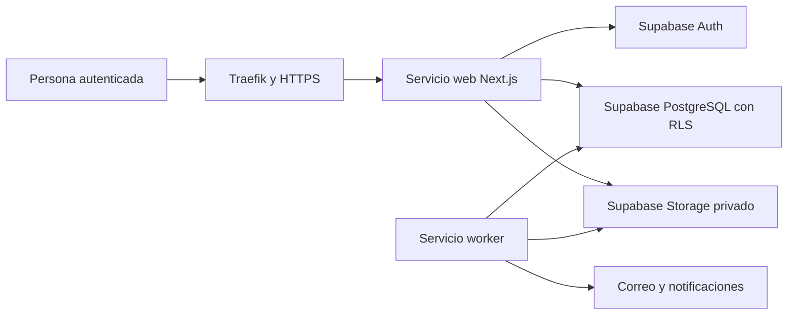

# Diseño de migración de ejecución a Supabase y despliegue con Dokploy

- **Fecha:** 2026-10-08
- **Estado:** Aprobado para planificación
- **Alcance:** Sustituir SQLite y el almacenamiento local en ejecución por el proyecto Supabase externo de LEXCON IAG; desplegar la web y el worker en Dokploy.

## Objetivo

Usar el proyecto Supabase externo ya desplegado como fuente definitiva de autenticación, datos relacionales y documentos privados. Dokploy ejecutará exclusivamente el cómputo de LEXCON IAG: la aplicación web Next.js y el worker de automatización. No se transferirán datos, usuarios ni archivos locales, porque los datos existentes son solo de demostración.

## Contexto verificado

Supabase ya contiene 61 tablas con nombres funcionales en español, RLS activo, el bucket privado `expediente-privado` y roles iniciales. La rama actual conserva una implementación operativa distinta basada en SQLite, sesiones locales, cola SQLite y almacenamiento local. La migración debe adaptar los consumidores de la aplicación al esquema remoto; registrar las credenciales de Supabase sin ese cambio no altera la persistencia en ejecución.

## Arquitectura seleccionada

Dokploy usará Docker Compose para iniciar dos servicios desde la misma imagen de aplicación:

1. `web`: ejecuta Next.js y atiende tráfico HTTP interno en el puerto 3000.
2. `worker`: procesa de manera continua tareas de análisis, entrega de correo y notificaciones.

No habrá un contenedor de base de datos ni un volumen local para procesos, archivos, sesiones o cola. Los directorios temporales del contenedor se tratan como efímeros.

## Autenticación, autorización y datos de demostración

La autenticación de producción se trasladará a Supabase Auth. La aplicación resolverá la sesión autenticada y operará con el contexto de usuario para que las políticas RLS apliquen por persona, rol, Institución Educativa y proceso.

El dato inicial será una semilla idempotente de demostración: cuatro cuentas ficticias, sus perfiles, roles y asignaciones necesarios para recorrer los espacios administrativo, jurídico e institucional. La semilla solo contiene información ficticia y se ejecuta explícitamente en entornos de demostración; el despliegue de producción real no crea ni conserva contraseñas conocidas de demostración.

La clave de servicio de Supabase se reserva para operaciones administrativas estrictamente del servidor, como la provisión controlada de cuentas ficticias y tareas del worker que no actúan en nombre de una sesión. Nunca se expone al navegador ni se etiqueta con `NEXT_PUBLIC_`.

## Migración por límites técnicos

La implementación se divide en incrementos verificables dentro de una misma rama de migración. Ningún incremento habilita datos institucionales reales hasta que todos estén aprobados.

1. **Configuración y acceso.** Incorporar la configuración validada de Supabase, clientes diferenciados por sesión y servidor, Supabase Auth y la semilla ficticia idempotente.
2. **Datos de negocio.** Reemplazar los repositorios SQLite por operaciones sobre `perfiles_usuario`, `asignaciones_roles_usuario`, `instituciones_educativas`, `procesos_contratacion`, historial, alertas y las demás relaciones del esquema remoto. Las rutas y módulos conservan sus contratos funcionales, pero no ejecutan SQL SQLite.
3. **Archivos.** Reemplazar las rutas locales por Storage privado `expediente-privado`; guardar en `archivos_documento` los metadatos, hash, ruta y versión. Cada descarga requiere autorización antes de emitir una URL temporal o entregar el contenido.
4. **Worker.** Sustituir la cola SQLite por el modelo de tareas y entregas persistido en Supabase. Las operaciones deben ser idempotentes, registrar intento, resultado y error, y evitar que dos ejecuciones procesen la misma tarea.
5. **Despliegue.** Añadir Dockerfile, `.dockerignore` y Compose para `web` y `worker`; Dokploy construye desde `main`, recibe secretos en su panel y usa su dominio temporal HTTPS durante la validación.

## Continuidad, seguridad y lanzamiento

- Los secretos se registran exclusivamente en Dokploy; el repositorio conserva solo nombres de variables y ejemplos sin valores.
- La verificación de RLS cubre lectura y escritura de dos instituciones distintas, de un abogado asignado y de un usuario sin permiso.
- Los respaldos de PostgreSQL y de objetos de Storage se programan y restauran por procedimientos separados antes de la producción real.
- El dominio temporal de Dokploy solo permite pruebas con datos ficticios. El lanzamiento real exige dominio propio HTTPS, configuración de respaldo aprobada y usuarios institucionales creados de manera controlada.
- Las migraciones de esquema y los cambios de datos se ejecutan de forma explícita y reversible; un despliegue de aplicación no altera datos destructivamente por sí mismo.

## Criterios de aceptación

1. La aplicación inicia sin `better-sqlite3`, sin `LEXCON_DATABASE_URL` y sin crear archivos SQLite.
2. Las cuatro cuentas ficticias permiten completar los recorridos autorizados sobre Supabase Auth y RLS.
3. Procesos, actuaciones, auditoría, alertas y archivos se leen y escriben en Supabase, no en disco local.
4. El worker consume y registra una tarea de prueba sin duplicarla.
5. La prueba de Dokploy ejecuta `web` y `worker` separados y sirve la web por el dominio temporal HTTPS.
6. Las pruebas automatizadas y de restauración demuestran aislamiento, persistencia y recuperación antes de permitir datos reales.
